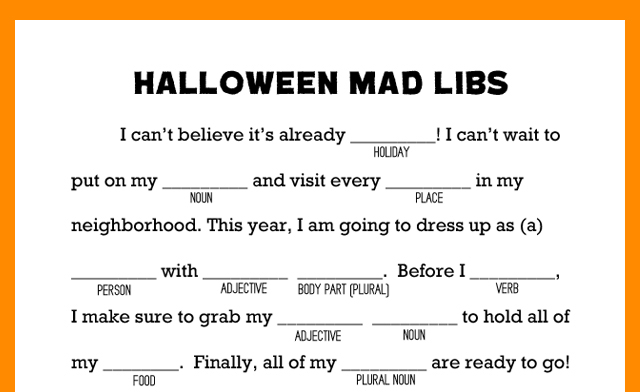
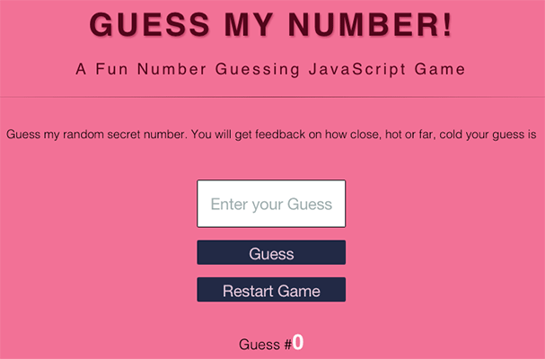
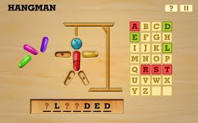

# Interactive-Games-Python-Project

### 1) Madlib Game : To Play the Game Click on the Image Below 👇

### 2) Guess The Number : To Play the Game Click on the Image Below 👇

### 3) Rock Papers Scissors : To Play the Game Click on the Image Below 👇

### 4) Hangman : To Play the Game Click on the Imaage Below 👇

 
